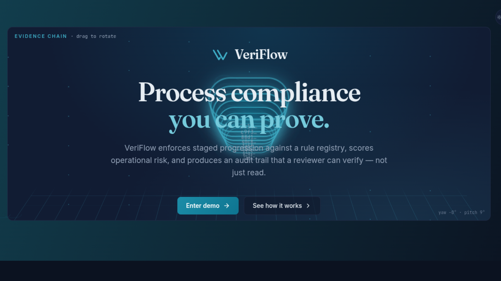

# VeriFlow



> Live demo: https://veriflow.up.railway.app/ — click Enter demo to auto-login as the admin account. No signup required.
> Built by Michael Palmer
<a href="https://www.linkedin.com/in/mpalmer1234/" target="_blank" rel="noopener noreferrer"></a> <a href="https://github.com/mpalmer79/" target="_blank" rel="noopener noreferrer"></a>

VeriFlow is a workflow and evidence-control platform for
compliance-heavy operations. It enforces staged progression against a
code-driven rule registry, scores operational risk, and produces a
tamper-evident audit trail and verifiable evidence chain so every
decision on a record is explainable after the fact.

The engine is domain-agnostic. The first reference scenario is a
healthcare intake workflow, but the same data model handles loan
intake, vendor onboarding, claims triage, and any process where
controlled state transitions and verifiable document evidence matter
more than throughput. VeriFlow is **not** an EHR, scheduling system,
or CRM.

## At a glance

- Stack: Next.js 14 + TypeScript + Tailwind on the frontend; FastAPI + SQLAlchemy 2.x + PostgreSQL on the backend
- Deployed on Railway with CI on every push (SQLite broad job, PostgreSQL targeted job, Playwright end-to-end)
- Hash-chained audit trail with a verify endpoint that walks the chain and reports broken links
- Streaming uploads with SHA-256 at ingest and re-hash at verification; one-use signed URLs for content delivery
- Code-driven rule registry with explainable risk scoring and stage-gated transitions
- Standalone design system at https://veriflow.up.railway.app/design-system — tokens, component previews, and full-screen mocks of every surface

## What it actually does

1. **Controlled state transitions.** Records move through an ordered
   set of workflow stages. Transitions are evaluated against the rule
   registry; failing rules either block progression or record a
   warning with explicit risk weight.
2. **Explainable risk scoring.** Every evaluation persists the rules
   it ran, each rule's outcome, and the risk it contributed, so a
   record's score is reconstructable from evidence, not opaque.
3. **Append-only audit trail with a hash chain.** Every domain event
   (stage transitions, document status changes, storage cleanups)
   writes a row whose `entry_hash` is SHA-256 over a canonical payload
   plus the previous row's hash. `/api/audit/verify` walks the chain
   and reports any broken link — a tamper-evident property the
   `/operations` console surfaces to admins directly.
4. **Document evidence with real hashing.** Uploads stream to a
   server-controlled storage root, compute SHA-256 in chunks during
   ingest, and re-hash on verification / integrity check so any
   rewrite of an on-disk file is visible. Metadata-only documents are
   distinguished throughout the UI and API from upload-backed
   evidence.
5. **Signed short-lived content access.** Browsers fetch preview and
   download URLs via one-use signed tokens (distinct JWT audience,
   short TTL, bounded single-node replay prevention) so the browser
   can load content directly without leaking the Authorization
   header.

## Architecture at a glance

- **Backend.** FastAPI + SQLAlchemy 2.x on PostgreSQL (SQLite for
  local tests). Code-driven rule registry, stage-gated transitions,
  risk scoring, optimistic concurrency via `version` on records,
  tamper-evident audit chain (SHA-256 per row, chained by
  `previous_hash`), a local evidence store with real content hashing
  at ingest and re-hashing at verification, liveness (`/health`) and
  readiness (`/health/readiness` with a live DB ping) probes for
  hosted deploys.
- **Frontend.** Next.js 14 + TypeScript + Tailwind with Inter,
  JetBrains Mono, and Fraunces (display) via `next/font`, a brand
  teal ramp for accents, and Framer Motion as the single motion
  primitive. The root `/` is a product landing page with a real
  `SeverityPanel` mock, an animated hash-chain motif, and a
  three-CTA hero (Enter demo, See how it works, View design
  system). The landing page always renders — authenticated
  visitors see it rather than getting silently redirected — and
  the primary CTA auto-signs-in as admin for a zero-friction demo.
  The record detail page is led by a `DecisionBanner` that is the
  verdict surface: a compact orientation strip for context, a
  verdict heading sized as the largest type on the page, a
  promoted top-issue block with rule code and risk contribution,
  and a contextual primary CTA that switches between "Resolve
  blocking issues," stage advancement, or evaluation depending on
  state. Below it, a componentized stack: evaluation panel with
  can-progress and risk-score bars that animate between states, a
  `WorkflowTimeline` with animated advance, an evidence panel with
  a keyboard-accessible overflow menu for secondary document
  actions, an audit trail with human-readable events and copyable
  rule-code badges, and a preview modal with accessible dialog
  semantics. The dashboard is an operations-intelligence surface:
  KPI hero cards with count-up animation, 30s visibility-gated
  polling with a LIVE / STALE pill, and a `Needs attention` table
  that stagger-reveals on mount and smoothly reflows on poll
  changes. Destructive confirmations use the shared in-app
  `ConfirmDialog`. Admins get an `/operations` console for
  audit-chain verification, managed-storage inventory, and
  bounded orphan cleanup. Status messaging routes through a
  shared toast stack. Records page filters are URL-synced so
  refresh / back-button / shared links reproduce the view. Every
  Framer Motion call site consults `useReducedMotion()` and
  collapses to an instant state change under
  `prefers-reduced-motion`; `docs/ui_motion_audit.md` catalogues
  every usage.
- **Design system.** A standalone reference at
  `design-system/` in the repo and at `/design-system` on the
  deployed site. Canonical tokens live in
  `design-system/colors_and_type.css`; HTML previews under
  `design-system/preview/` cover colors, typography, spacing,
  badges, buttons, forms, KPI cells, severity panels, and
  timelines. A React-based UI kit under
  `design-system/ui_kits/veriflow_web/` renders full-screen mocks
  of every app surface (landing, dashboard, records, record
  detail, operations). A prebuild step copies the folder into
  the Next.js `public/` tree so Railway serves it at the same
  origin as the app.
- **Evidence.** Streaming upload writes straight to a server-
  controlled storage root with chunked SHA-256; verification re-reads
  and re-hashes those bytes; content delivery supports HTTP `Range`
  and short-lived signed URLs so browsers load preview/download
  directly without prefetching the full blob. A bounded in-memory
  jti guard enforces one-use semantics on signed URLs within the
  token's TTL (single-replica; swap for Redis to scale horizontally).
- **Security.** JWT with explicit `iss` / `aud` / `typ` / `jti`;
  separate audience for short-lived content-access tokens;
  one-use-within-TTL replay prevention on signed URLs; app-wide
  security headers and a tight CSP; environment-driven CORS;
  role-gated admin routes; in-memory sliding-window rate limiter on
  auth, upload, and signed-access issuance; `APP_ENV`-gated refusal
  to run with the default JWT secret; dev-only demo seed with an
  explicit `VERIFLOW_ALLOW_SEED` override for staging.

## Capabilities

- Controlled multi-stage workflows with explicit terminal states
- Code-driven rule registry evaluated per record at the appropriate
  stage context
- Risk scoring with a banded classification (`low` / `moderate` /
  `high` / `critical`)
- Document evidence with real server-computed content hashes and
  verification-time re-hashing; metadata-only documents are
  distinguished from upload-backed evidence throughout the UI and API
- Stage-gated transitions that block on failing rules and explain the
  reason
- Append-only audit log with canonical, structured payloads and a
  verifiable hash chain

## Example: healthcare intake

A record represents a prospective patient progressing through a
nine-stage workflow:

1. **New Intake** — record created, basic identifying details captured
2. **Identity Verification** — government ID and demographic checks
3. **Insurance Review** — coverage verified, pending, or self-pay
4. **Consent & Authorization** — required forms signed and current
5. **Clinical History Review** — intake forms complete and reviewed
6. **Provider Triage** — clinical handoff to the appropriate provider
7. **Ready for Scheduling** — all checks passed; eligible to schedule
8. **Blocked** — one or more rules failed; resolution required
9. **Closed** — terminal disposition for the record

The scenario is illustrative only. No PHI handling, HIPAA controls, or
clinical decision support are implied.

## Repository layout

```
.
├── ARCHITECTURE.md
├── README.md
├── docker-compose.yml          Local Postgres + backend + frontend
├── .github/workflows/ci.yml    Backend (sqlite + postgres) + frontend CI
├── backend/
│   ├── Dockerfile
│   ├── alembic.ini             Alembic config
│   ├── migrations/             Incremental migrations (baseline locked)
│   ├── app/
│   │   ├── api/routes/         Thin HTTP routes
│   │   ├── core/               config, database, security, evidence_storage, rate_limit
│   │   ├── models/             SQLAlchemy 2.x models + enums
│   │   ├── repositories/       data access
│   │   ├── schemas/            Pydantic request/response shapes
│   │   ├── services/
│   │   │   ├── document_service/   Package: ingest / verification /
│   │   │   │                       content / cleanup / summary
│   │   │   ├── audit_service.py    Chained audit writer + verify_chain
│   │   │   ├── workflow_service.py Transition enforcement
│   │   │   └── …
│   │   └── seed/               Idempotent demo data
│   └── tests/                  pytest suite (SQLite by default,
│                               Postgres when TEST_DATABASE_URL is set)
├── design-system/              Standalone reference: tokens, previews,
│                               and full-screen UI kit mocks
├── frontend/
│   ├── Dockerfile
│   ├── app/                    Next.js app-router pages
│   ├── components/             Shared + record-detail component split
│   └── lib/                    api.ts, types.ts, auth, format
└── docs/
```

## Running locally

### With Docker Compose (recommended)

```bash
docker compose up --build
```

This starts Postgres, applies Alembic migrations, runs the idempotent
seed, and serves the backend on `:8000` and the frontend on `:3000`.

### Native

Backend:

```bash
cd backend
python3 -m venv .venv && source .venv/bin/activate
pip install -r requirements.txt
cp .env.example .env

# Apply migrations (production) or skip to the seed (local demo):
alembic upgrade head

python -m app.seed.seed_data
uvicorn app.main:app --reload --port 8000
```

- Interactive API docs: <http://localhost:8000/docs>
- Liveness check: <http://localhost:8000/health>
- Readiness check (DB ping): <http://localhost:8000/health/readiness>

Frontend:

```bash
cd frontend
cp .env.example .env.local
npm install
npm run dev
```

The frontend `build` script runs a `prebuild` step that copies
`design-system/` into `frontend/public/design-system/` so the deployed
Next.js app serves the design system at `/design-system` on the same
origin. The copied tree is gitignored; the source of truth is the
top-level `design-system/` folder.

## Local demo access

The seed script provisions four local demo accounts — one per role —
so the API can be exercised end-to-end without configuring an identity
provider. These credentials exist **only** in local seeded databases
and are not valid against any hosted environment.

| Role                  | Email                     |
|-----------------------|---------------------------|
| `admin`               | `admin@veriflow.demo`     |
| `intake_coordinator`  | `intake@veriflow.demo`    |
| `reviewer`            | `reviewer@veriflow.demo`  |
| `manager`             | `manager@veriflow.demo`   |

The shared demo password lives in
`backend/app/seed/seed_data.py::DEFAULT_PASSWORD`. Change it before
running the seed in any shared environment.

## Configuration

Key environment variables (see `backend/.env.example` for the full
list):

| Variable | Purpose |
|----------|---------|
| `APP_ENV` | `development` / `test` / `production`. Startup refuses to run in any non-dev env while `JWT_SECRET` is still the default. |
| `JWT_SECRET` | HMAC secret for access and content-access tokens. |
| `JWT_ISSUER` / `JWT_AUDIENCE` | Identify this deployment in minted tokens. |
| `DATABASE_URL` | Production is PostgreSQL; local/tests default to SQLite. |
| `CORS_ORIGINS` | Comma-separated origin allowlist (default `http://localhost:3000`). |
| `CORS_ALLOW_METHODS` / `CORS_ALLOW_HEADERS` | Tight defaults; override with care. |
| `EVIDENCE_STORAGE_DIR` | Managed local storage root for uploaded bytes. |
| `MAX_UPLOAD_BYTES` | Per-file cap enforced during streaming ingest. |
| `CONTENT_ACCESS_TTL_SECONDS` | Short-lived signed-URL expiry. |
| `RATE_LIMIT_LOGIN_PER_MINUTE` / `..._UPLOAD_PER_MINUTE` / `..._SIGNED_ACCESS_PER_MINUTE` | Per-IP or per-user sliding-window budgets. |

## CI

`.github/workflows/ci.yml` runs on every push and pull request. The two
backend jobs are scoped so neither pays for the other's work:

- **`backend (sqlite, broad)`** — installs backend deps and runs the
  full suite against in-memory SQLite, skipping anything marked
  `postgres`. This is the fast feedback loop; almost all behavioural
  assertions (auth, records, evaluations, transitions, documents, audit,
  rate limits, content delivery, operations) live here.
- **`backend (postgres, targeted)`** — stands up a `postgres:16` service
  container and runs only tests marked `postgres` or `migration`, plus a
  full `alembic upgrade head` → `downgrade base` → `upgrade head`
  round-trip. These are the assertions that would silently pass on
  SQLite but need real PostgreSQL semantics: partial unique indexes on
  nullable columns, `IntegrityError` surfaced via psycopg2, native enum
  types, and the baseline migration shape.
- **`frontend`** — `npm ci`, `npm run type-check`, `npm run build`.
- **`e2e (playwright, chromium)`** — depends on `backend-sqlite` and
  `frontend`. Installs Chromium with system dependencies, applies
  migrations, seeds SQLite, builds the frontend, and boots both
  services in background processes before running the Playwright
  suite with a single worker (auth/shell, records list → detail +
  metadata-only gating, confirm-dialog, operations admin,
  typography/motion wiring). Chromium-only on purpose; Firefox and
  WebKit are not worth the doubled runtime at current coverage.

Adding a test that depends on PostgreSQL-only semantics? Tag it with
`@pytest.mark.postgres` (or `@pytest.mark.migration` for migration file
inspections). The SQLite job deselects them; the PostgreSQL job opts
them in.

## Migrations

Alembic lives in `backend/migrations/`. The baseline
`0001_initial_schema.py` is **locked**; every schema change must be a
new incremental revision. Day-to-day:

```bash
cd backend
alembic upgrade head                  # apply all migrations
alembic revision -m "add <thing>"     # new empty revision
alembic revision --autogenerate -m "…"
alembic downgrade -1                  # roll back one revision
alembic stamp head                    # mark an existing DB as migrated
```

See `docs/migrations.md` for the baseline strategy.

## Testing

Backend:

```bash
cd backend
pytest                                # all tests (SQLite)
pytest -m "not postgres"              # broad suite only; mirrors the SQLite CI job
pytest -m "postgres or migration"     # targeted subset; mirrors the PostgreSQL CI job
TEST_DATABASE_URL=postgresql+psycopg2://… pytest -m "postgres or migration"
```

The SQLite default keeps the local loop fast; the PostgreSQL path is
wired for CI and can be run locally by exporting `TEST_DATABASE_URL`.
Every test resets the schema, the evidence storage tempdir, and the
rate-limit buckets to avoid state bleed.

Frontend unit/type checks:

```bash
cd frontend
npm run type-check
npm run build
```

Frontend end-to-end (Playwright):

```bash
cd frontend
npm run test:e2e:install      # one-time; downloads Chromium
npm run test:e2e              # requires backend + frontend running locally
```

The Playwright suite is intentionally small: auth/shell smoke checks,
the records flow (list → detail, critical sections present,
metadata-only documents do not surface upload-only actions), and the
operations admin console (admin sees panels; non-admin sees the
access-required empty state). See `frontend/tests/e2e/README.md` for
the required stack setup.

## Security posture

- Startup **fails loudly** in non-dev environments if `JWT_SECRET` is
  still the default.
- JWTs use explicit `iss` / `aud` / `typ` / `jti`. Access tokens use
  `aud=veriflow-api`; short-lived content-access tokens use
  `aud=veriflow-content` and cannot cross over.
- CORS is environment-driven: explicit methods / headers rather than
  `["*"]`, and `expose_headers` is narrow.
- App-wide middleware sets `X-Content-Type-Options: nosniff`,
  `Referrer-Policy: no-referrer`, `Permissions-Policy`, and a
  restrictive Content-Security-Policy
  (`default-src 'none'; frame-ancestors 'self' <cors origins>`).
  Interactive docs routes are exempted so Swagger / ReDoc still load.
- Admin/debug routes (`/api/audit/verify`,
  `/api/audit/storage-inventory`, `/api/audit/storage-cleanup`)
  require the `admin` role.
- Rate limits on `/api/auth/login`, `/api/records/{id}/documents/upload`,
  and `/api/documents/{id}/signed-access`. Sliding-window, in-process;
  swap for Redis-backed if you run multiple replicas.

## Engineering log

A sequence of scoped, single-commit PRs against a staff-level remediation
plan produced the current state of the codebase: a code-driven rule
engine with explainable risk scoring, a SHA-256 hash-chained audit trail
with a verify endpoint, streaming upload and verification with
signed-URL content delivery and bounded replay prevention, a two-job
backend CI split (SQLite broad and PostgreSQL targeted), a chromium-only
Playwright end-to-end job against the real stack, a verdict-led record
detail page built around an evaluation-aware `DecisionBanner`, and a
standalone design system served at `/design-system` on the same origin
as the app. Full history in CHANGELOG.md.

## Known limitations

- **Rate limiter is in-process.** Fine for a single-replica deployment
  but does not share state across instances. Swap for Redis-backed
  `limits.storage.RedisStorage` (or similar) for horizontal scaling.
- **Evidence storage is local only.** No S3 / GCS. The storage
  interface is small enough that a cloud-backed implementation can
  live behind `evidence_storage` without schema changes.
- **Playwright in CI is chromium-only and single-replica.** The
  `e2e (playwright, chromium)` job boots backend+frontend in
  background processes against SQLite and runs the small spec suite.
  Firefox and WebKit are not covered in CI by design; the
  return-on-CI-minutes is not worth the doubled runtime. Locally,
  run `npm run test:e2e` against any running stack.
- **Signed content-access jti tracking is single-node.** The bounded
  in-memory replay guard prevents reuse of a captured URL after a
  short grace window, but it only enforces that within one backend
  process. A multi-replica deployment would need to swap in a shared
  store (e.g. Redis) for the guard; the module boundary in
  `app.core.content_access` is intentionally small enough for that.
- **Alembic runs at start-up** in both the local compose stack and
  hosted deployments (see `docs/deployment.md`). There is no separate
  release phase — risky schema changes should ship as a two-step
  deploy so the running revision tolerates both schemas.

## References

- [`ARCHITECTURE.md`](./ARCHITECTURE.md) — system design and service boundaries
- [`docs/workflow_rules.md`](./docs/workflow_rules.md) — stages, rule catalogue, evaluation semantics
- [`docs/document_evidence.md`](./docs/document_evidence.md) — document model and hybrid rule contract
- [`docs/product_overview.md`](./docs/product_overview.md) — problem framing and product capabilities
- [`docs/migrations.md`](./docs/migrations.md) — Alembic layout and evolution strategy
- [`docs/deployment.md`](./docs/deployment.md) — Railway deployment wiring and release workflow
- [`docs/build_history.md`](./docs/build_history.md) — original multi-phase build prompt preserved as historical context
